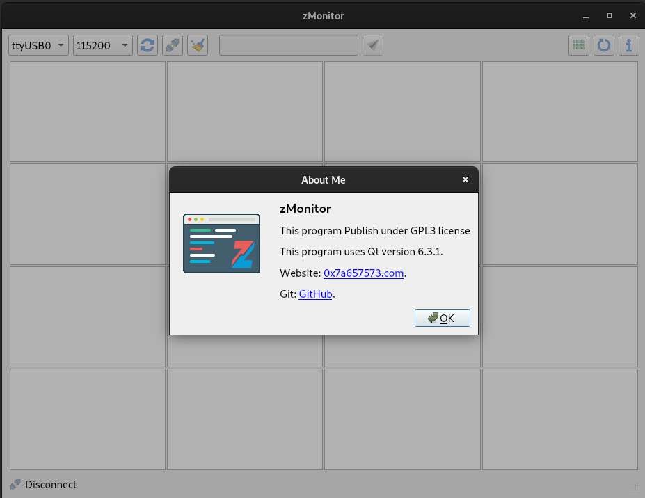
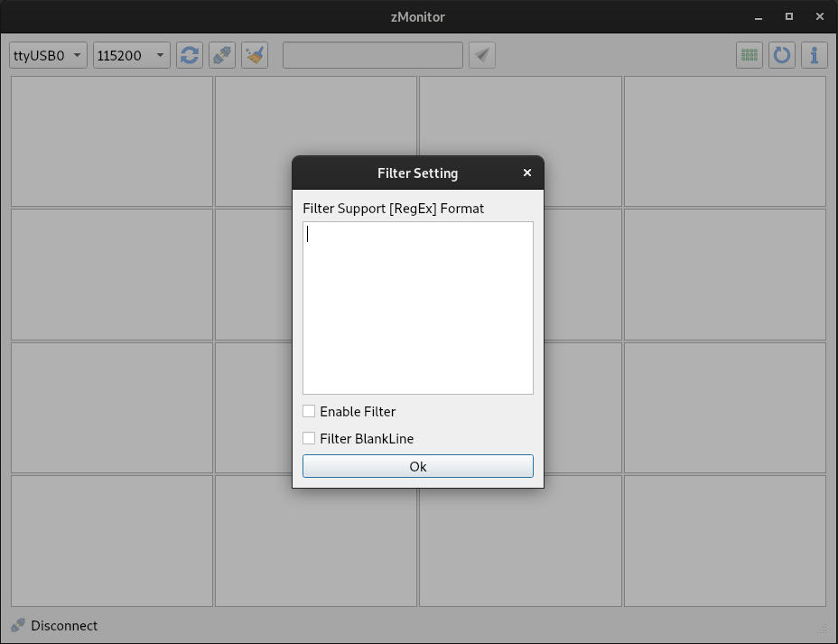

# zMonitor logging view
zMonitor is a multi-platform and open-source helpful logging software for embedded devices written in QT. This software uses the serial port for logging any microcontroller or embedded board.

## Why do we need to use zMonitor?
Today we have a powerful microcontroller that can run a different type of RTOS with a lot of tasks. It's good but makes challeng to monitor each task.
zMonitor helps us to monitor each task separately! with this ability, we can focus on the activity of one task.

## Future of zMonitor

* multi-platform
* Support ANSI Escape color
* Support 16 Task continuously view
* Support Regx filter for each task
* Configurable each task log view property
* Selectable Font-size/Color for each task

## Screenshot
### about me:

### Regx filter dialog:
